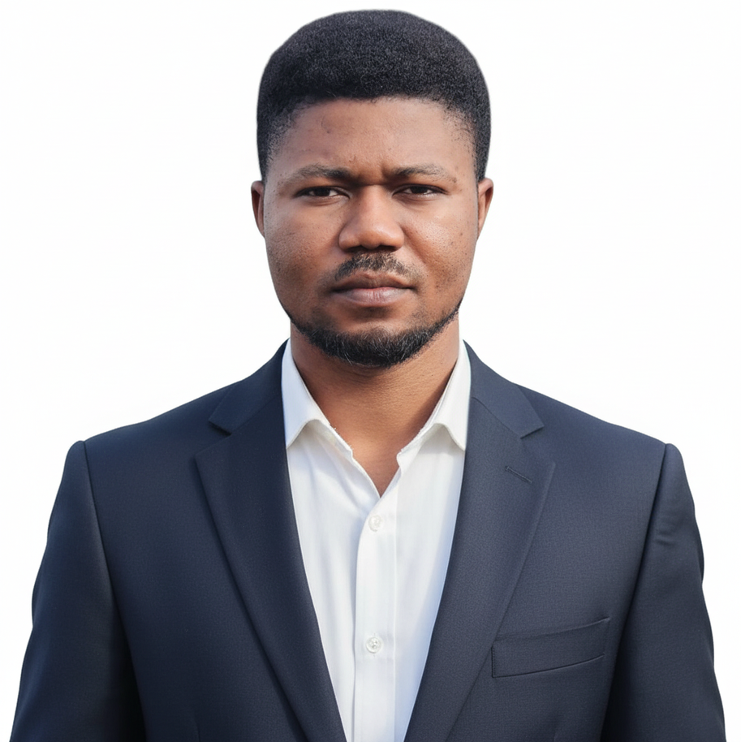

:::{.columns}

::: {.column width=0.70}

## Ebenezer O. Makinde  
**PhD Candidate in Political Science**  
[Tulane University](https://liberalarts.tulane.edu/political-science)

### Contact & Profiles
- ✉️ [Email](mailto:emakinde@tulane.edu)  
- 💼 [LinkedIn](https://www.linkedin.com/in/ebenezermakinde/)  
- 💻 [GitHub](https://github.com/Ebenad)  
- 📚 [Google Scholar](https://scholar.google.com/citations?user=L7VuBQUAAAAJ&hl=en)  

:::

::: {.column width=0.30}

{fig-alt="Ebenezer O. Makinde" style="width: 350px; height: 350px; border-radius: 50%; object-fit: cover; object-position: 50% 20%; display: block; margin: 15px auto 0 auto;"}

:::

:::

### Welcome!

I am a PhD. candidate in Political Science at [*Tulane University*](https://liberalarts.tulane.edu/political-science). My research addresses questions at the intersection of politics and public policy. My dissertation project examines downstream effects of anti-corruption politicization with particular attention to how political considerations in corruption prosecution influence the effectiveness and outcomes of anti-corruption efforts.

My broader research agenda spans comparative politics, African political economy, and public policy, with a regional focus on Nigeria and Africa. I work extensively with original and administrative data on corruption prosecutions, public opinion, political behavior, and governance outcome, as well interviews, archival data and survey data. 

In other ongoing projects, I am examining the political economy of corruption prosecution outcomes in Nigeria, African public opinion on great-power competition in Africa, and government–NGO relations in Nigeria. My works have been published in peer-reviewed journals including [*Policy & Internet*](https://doi.org/10.1002/poi3.416), [*Protest*](https://brill.com/view/journals/prot/4/1/article-p5_002.xml), [*World Journal of Advanced Research and Reviews*](https://doi.org/10.30574/wjarr.2024.23.2.2385), and [*GSC Advanced Research and Reviews*](https://doi.org/10.30574/gscarr.2024.21.2.0415).

Before graduate school, I held research, policy and data analytics roles in France, South Africa (remote), and Nigeria, including positions at SCOR Reinsurance and the African Leadership Academy. These experiences continue to inform my interest in evidence-based public policy and the design of institutions that promote government accountability and good governance.
